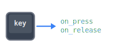

# talon-pynput



pynput key listener for Talon. Register any key, combo, or sequence to trigger callbacks on a separate thread, so voice commands won't interrupt your input.

## Installation

### Dependencies

- [**pynput**](https://pypi.org/project/pynput/) (Python package)

### 1. Install Python Packages

Install using Talon's bundled pip:

```sh
# Windows
~/AppData/Roaming/talon/venv/[VERSION]/Scripts/pip.bat install pynput

# Linux/Mac
~/.talon/bin/pip install pynput
```

### 2. Clone Repositories

Clone this repo into your [Talon](https://talonvoice.com/) user directory:

```sh
# Mac/Linux
cd ~/.talon/user

# Windows
cd ~/AppData/Roaming/talon/user

git clone https://github.com/rokubop/talon-pynput
```

## Usage

```py
# Single key
actions.user.pynput_register("f22", on_press_fn, on_release_fn)
actions.user.pynput_register("f22", on_press_fn)          # press only
actions.user.pynput_register("f22", None, on_release_fn)  # release only

# Combo (simultaneous hold)
actions.user.pynput_register("ctrl-super", on_press_fn)

# Mouse button
actions.user.pynput_register("mouse_left", on_press_fn, on_release_fn)
actions.user.pynput_register("ctrl-mouse_left", on_press_fn)  # mixed

# Sequence (keys in order, 300ms window)
actions.user.pynput_register("j j", on_press_fn)
actions.user.pynput_register("ctrl-space c", on_press_fn)

# Multiple at once
actions.user.pynput_register({
    "f22": (on_press_fn, on_release_fn),
    "f23": (on_press_fn,),
})

# Unregister (removes all registrations)
actions.user.pynput_unregister("f22")
actions.user.pynput_unregister(["f22", "f23"])

# Unregister last (pops most recent, restores previous)
actions.user.pynput_unregister_last("f22")
actions.user.pynput_unregister_last(["f22", "f23"])

# Query
actions.user.pynput_is_held("f22")        # bool
actions.user.pynput_is_held("ctrl-super") # True if both held
actions.user.pynput_is_active()           # any listener running?
```

## Actions

```
user.pynput_register        Register key(s) with callbacks
user.pynput_unregister      Remove all registrations for key(s)
user.pynput_unregister_last Remove most recent registration (restores previous)
user.pynput_is_held         Check if a key or combo is held down
user.pynput_is_active       Check if any listener is running
user.pynput_tests           Run tests in Talon REPL
```

## Example: foot pedals for a game

```py
PEDAL_LEFT = "f22"
PEDAL_CENTER = "f23"
PEDAL_RIGHT = "f24"

def pedal_left_down():
    actions.user.gamekit_key_hold("z")

def pedal_left_up():
    actions.user.gamekit_key_release("z")

def pedal_center_down():
    actions.user.input_map_mode_set("move")

def pedal_center_up():
    actions.user.input_map_mode_set("default")

def on_mode_enabled():
    actions.user.pynput_register({
        PEDAL_LEFT:   (pedal_left_down, pedal_left_up),
        PEDAL_CENTER: (pedal_center_down, pedal_center_up),
        PEDAL_RIGHT:  (pedal_right_down, pedal_right_up),
    })

def on_mode_disabled():
    actions.user.pynput_unregister_last([PEDAL_LEFT, PEDAL_CENTER, PEDAL_RIGHT])
```

## Key syntax

Use `-` to combine keys into combos (same as Talon's `key()` action). `+` is also accepted. Use spaces for sequences: `"j j"` means tap j twice within 300ms.

**Aliases:** `super`/`win` maps to `cmd`, `control` to `ctrl`, `escape` to `esc`, `return` to `enter`. Left/right variants (`ctrl_l`, `ctrl_r`) normalize to their base (`ctrl`).

**Mouse buttons:** `mouse_left`, `mouse_right`, `mouse_middle`

<details>
<summary>All supported keys</summary>

**Characters:** Any single character - `a`, `b`, `*`, `-`, `0`, `1`, etc.

**Function keys:** `f1`-`f24`

**Modifiers:** `shift`, `ctrl`, `alt`, `cmd` (`super`/`win`), `alt_gr`

**Navigation:** `up`, `down`, `left`, `right`, `home`, `end`, `page_up`, `page_down`

**Editing:** `backspace`, `delete`, `insert`, `tab`, `enter`, `space`, `esc`

**Lock keys:** `caps_lock`, `num_lock`, `scroll_lock`

**System:** `pause`, `print_screen`, `menu`

**Media:** `media_play_pause`, `media_volume_up`, `media_volume_down`, `media_volume_mute`, `media_next`, `media_previous`

**Mouse:** `mouse_left`, `mouse_right`, `mouse_middle`

</details>

## Troubleshooting

### Thread warning

The `WARNING User script started a thread` message is expected. pynput needs its own thread to work alongside voice commands.

### Listener lifecycle

Listeners start on first `pynput_register` and stop when all registrations are removed. Daemon threads die automatically when Talon exits.

## Tests

```py
actions.user.pynput_tests()
```
